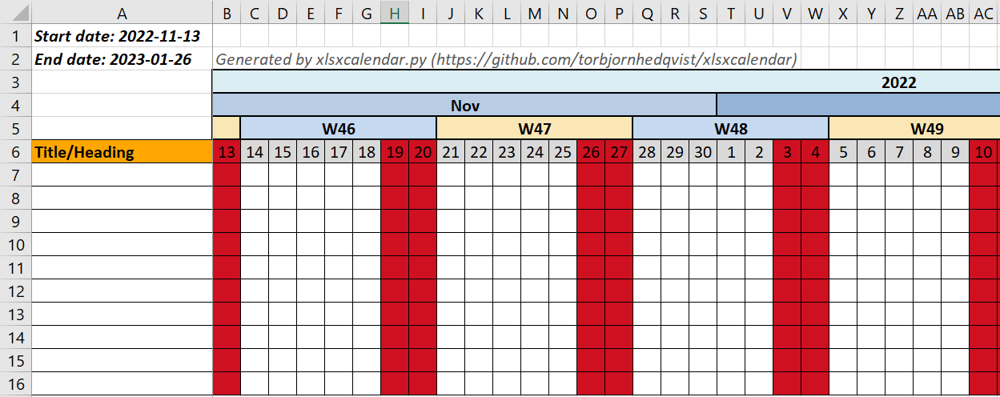

# xlsxcalendar

With *xlsxcalendar* you can create a MS Excel calendar for any date range in
seconds.

*xlsxcalendar* has a variety of configuration options to tailor your
calendar look and feel the way you want it.

*xlsxcalendar* also supports a plugin-system where you can create your own
importer modules to populate the calendar with input from other systems
exported data, most commonly used are comma separated files (CSV). This is
however not a limitation, any other format can be used as it will be up to you
as an importer plugin developer to adhere and make use of the plugin API.

The most basic setup with mandatory start and end dates as input, *no additional
configuration needed*, will create a calendar within that range, with 10 empty
rows and you can continue and do your remaining additions and changes from
within MS Excel.

Executing *xlsxcalendar* with the following options:
```bash
python3 xlsxcalendar.py -s 2022-11-13 -e 2023-01-26
```
Will create a calendar as described in the simple screenshot below.



Enabling features like color-themes, local-holidays and importer plugin the
generated calendar can be much more advanced as in the screenshot below.

More information about setup, all bells and whistles for configuration can
be read about under the [documentation][docs].


[docs]: ./documentation/README.md
