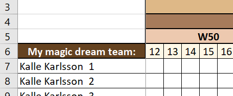
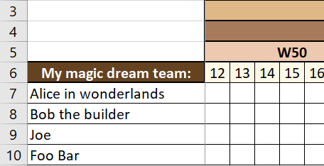
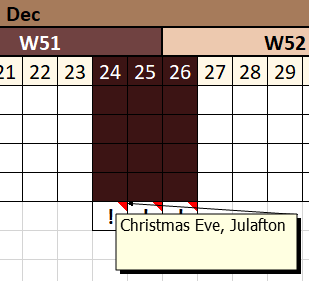

# User guide

## Setup: Using virtual environment, Docker or manual installation

### Setup using a virtual environment
This setup is verified with python 3.12.3. Start with cloning the 
*xlsxcalendar* repository.

```bash
# Change the directory to the root of the repository
cd <repo-root>
# Setup the virtual environment
python3 -m venv env
# Activate the virtual environment
source env/bin/activate
# Install the required modules provided in requirements.txt
pip install -r requirements.txt
```

Now you are ready to go, jump to the *Configuration* section below.

### Setup using Dockerhub image
Pull the xlsxcalendar container image from DockerHub with:
```bash
docker pull torbjornhedqvist/xlsxcalendar:latest
```

When installed see some simple examples in my Dockerhub project at
[torbjornhedqvist/xlsxcalendar][dockerhub]

Now you are ready to go, jump to the *Configuration* section below.

### Building a local docker image
In case you would like to build the container locally here is an example.
From the repo root directory where I provided a `Dockerfile` execute the command below. 
I removed my dockerhub identity from the image name and if you use the examples at dockerhub 
make sure to modify appropriately.
```bash
docker build --build-arg USER_ID=$(id -u) --build-arg GROUP_ID=$(id -g) \
-t xlsxcalendar .
```

### Multiuser web-server docker image
`xlsxcalendar_multiuser.py` and associated files are currently experimental and in development.
To be used at own risk.

### Manual setup/installation
This setup is verified with python 3.12.3. Start with cloning the 
*xlsxcalendar* repository.

Use pip or pip3 dependent on your environment settings.

We have a dependecy to distutils which was deprecated in Python 3.10 
by PEP 632. The setuptools still provides distutils.
```bash
pip install setuptools
```

*xlsxcalendar* requires two open source modules [Xlsxwriter][xlsxwriter]
and [PyYAML][pyyaml]. Make sure to install them first.
```bash
pip install pyyaml
pip install xlsxwriter
```

If you are using the `/plugin/ess_importer.py` plugin there are two additional
modules required. This is to enable to possibility to automatically convert
from Excel formatted to semicolon formatted CSV file format.
```bash
pip install pandas
pip install openpyxl
```

## Configuration

The first and simplest test is to create an empty calendar with all default
values and just providing a start and end date from command line.

```bash
# As an executable if your environment supports it.
./xlsxcalendar.py -s 2022-11-13 -e 2023-01-26
# Or by calling it from python (Need to be version 3.6 or higher)
python3 ./xlsxcalendar.py -s 2022-11-13 -e 2023-01-26
```
The default output excel file will be stored in the current directory as
`./output.xlsx`

### Using a configuration file
All configuration can be handled through the `./xlsxcalendar.yaml`
configuration file. All, except the mandatory start and end date
options are commented out by default. Browse through the configuration file
and you will get a good overview of all possible settings, or read the
sections below for a more verbose description.

In addition or as a complement, many of the configuration options set in the
configuration file can be overridden from command line options. You can
view the available options with:

```bash
./xlsxcalendar.py --help
```

### Content heading

The option `content_heading:` will set the string in the heading of the
left-most row in the calendar and is a single key / value pair.
As an example using `content_heading: "My magic dream team:"` will
generate an output like this:



### Content entries

With `content_entries:` you can specify a **list** of strings which will be
put under the content heading. For each entry in the list an new row in the
calendar will be created. As an example:

```yaml
content_entries:
  - 'Alice in wonderlands'
  - 'Bob the builder'
  - 'Joe'
  - 'Foo Bar'
```

Will create an output like this:




### Output file

The path and file name of the generated Excel output file can be set with
the option `output_file:` If not set it will defaults to the current
directory from where the program is called and saved in a file named
`out.xlsx`

### Worksheet name and color

The options `worksheet_name:` and `worksheet_tab_color:` are self
explained. Worth mentioning is that the color should be defined as a
hex code value as in this example:
`worksheet_tab_color: '#ff9966'` and a good source for colors can
be found at [ColorHexa][colorhexa].

### Holiday imports

With `holiday_imports:` you can create separate files containing dates
which should be treated as days "off" like weekends in the calendar.
A good usage would be to create local country specific holiday lists which are
common to the majority of users. A few of those have been created as an
example in the *xlsxcalendar* directory `/imports/`. Multiple external files
can be imported as in this example:

```yaml
holiday_imports:
  - './imports/holidays_swe_2022.yaml'
  - './imports/holidays_swe_2023.yaml'
```

and a snippet from the first file `'./imports/holidays_swe_2022.yaml'`
contains:

```yaml
holidays:
  2022-12-24: 'Christmas Eve, Julafton'
  2022-12-25: 'Christmas Day ,Juldagen'
  2022-12-26: 'Boxing Day, Annandag jul'
```

This will mark these days columns with the same color as a weekend and
in addition exclamation character [ ! ] under the calendar with the string
defined for this date as a note. See the snapshot below:



In addition you can specify specific holidays in your own configuration
file as well and if any of your dates are in conflict with those from
imported files, your setting will take precedence. The format will be
the same as in the imported files as in this example:

```yaml
holidays:
  2022-05-27: "Friday after Ascension Day, company paid day off"
```

### Cell format imports

Cell format imports is a way to create separate *themes* to specify the
calendar format for rows like the year, months, weeks, days and content
row. All aspects of formatting supported in MS Excel can be set like
bold, italic, foreground and background color, borders etc.
By creating different *themes* you can switch the look-and-feel quickly.
A few examples have been created and are available in the *xlsxcalendar*
directory `/imports/` and can be imported by enabling the option
`theme_imports:` as in this example: `theme_imports:  './imports/theme_mocca.yaml'`

As an alternative or as a complement you can also define the cell formatting
in your own configuration file with the same options as defined in the
*themes* files and the valid options are: (Example enabled for weekends)

```yaml
cell_formats:
  day:
    # Modify with your preferences
  weekend:
    {'border': 1, 'align': 'center', 'fg_color': '#701c1c'}
  week_odd:
    # Modify with your preferences
  week_even:
    # Modify with your preferences
  month_odd:
    # Modify with your preferences
  month_even:
    # Modify with your preferences
  year_odd:
    # Modify with your preferences
  year_even:
    # Modify with your preferences
  content_heading:
    # Modify with your preferences
```

### Importer modules

You might have other external calendar planning tools like time reporting
systems or vacation planning and would like to import the data from those
into your calendar created by *xlsxcalendar*. This can be done by writing
your own python module plugin which can be dynamically added to *xlsxcalendar*
via the configuration file by using the option `importer_module:` as in
this example: `importer_module: 'plugins.ess_importer'`.
The plugins should be stored in the *xlsxcalendar* subdirectory /plugins
and the repo contains a bare minimum template named
`plugins/template_importer.py` and a working implementation using an
export format used within an organization in `plugins/ess_importer.py`

You can also speficy the data file which should be imported with the option
`importer_file: "filepath/filename"` or you can specify this file from
the command line options using `-i <filename>` or `--import-file <filename>`.

## How to write an importer module

If you want to write your own importer module there are two abstract
functions/methods that needs to be implemented by you. These are described in
[`/plugins/abstract_importer.py`][plugin] and it is a `load()` and a `plot()`
function.

If an importer module is defined the `load()` function will be called by the
main program before the layout of the calendar and MUST contain a python
list with all the entries which should be placed in the content row. The
number of items in this list will define the number of rows your calendar will
have.

If an importer module is defined the `plot()` function will be called after
the calendar is created and access to all configuration and the workbook
will be provided as arguments. This should be sufficient for an implementer
to convert and *plot* out the content from the imported data file in the
correct place in the calendar.

[xlsxwriter]: https://github.com/jmcnamara/XlsxWriter
[pyyaml]: https://github.com/yaml/pyyaml
[colorhexa]: https://www.colorhexa.com/color-names
[plugin]: ../plugins/abstract_importer.py
[dockerhub]: https://hub.docker.com/r/torbjornhedqvist/xlsxcalendar
