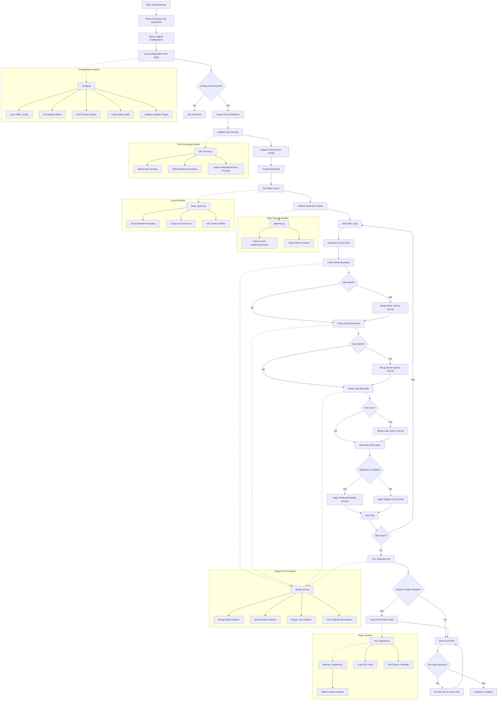

# XlsxCalendar Program Flow

```mermaid
flowchart TD
    A[Start xlsxcalendar.py] --> B[Parse Command Line Arguments]
    B --> C[Setup Logging Configuration]
    C --> D[Load Configuration from YAML]
    
    D --> E{Config Load Success?}
    E -->|No| F[Exit with Error]
    E -->|Yes| G[Create Excel Workbook]
    
    G --> H[Initialize Cell Formats]
    H --> I[Update Formats from Config]
    I --> J[Create Worksheet]
    J --> K[Set Static Layout]
    
    K --> L[Initialize Date Info Tracker]
    L --> M[Start Date Loop]
    
    M --> N[Calculate Current Date]
    N --> O[Check Week Boundary]
    O --> P{New Week?}
    P -->|Yes| Q[Merge Week Cells & Format]
    P -->|No| R[Check Month Boundary]
    Q --> R
    
    R --> S{New Month?}
    S -->|Yes| T[Merge Month Cells & Format]
    S -->|No| U[Check Year Boundary]
    T --> U
    
    U --> V{New Year?}
    V -->|Yes| W[Merge Year Cells & Format]
    V -->|No| X[Write Day Information]
    W --> X
    
    X --> Y{Weekend or Holiday?}
    Y -->|Yes| Z[Apply Weekend/Holiday Format]
    Y -->|No| AA[Apply Regular Day Format]
    Z --> BB[Next Day]
    AA --> BB
    
    BB --> CC{More Days?}
    CC -->|Yes| M
    CC -->|No| DD[Trim Calendar End]
    
    DD --> EE{Importer Plugin Available?}
    EE -->|Yes| FF[Load & Plot Import Data]
    EE -->|No| GG[Save Excel File]
    FF --> GG
    
    GG --> HH{File Save Success?}
    HH -->|No| II[Prompt User to Close File]
    HH -->|Yes| JJ[Program Complete]
    II --> GG
    
    subgraph "Configuration Module"
        KK[config.py]
        KK --> LL[Load YAML Config]
        KK --> MM[Set Default Values]
        KK --> NN[Load Theme Imports]
        KK --> OO[Load Holiday Data]
        KK --> PP[Initialize Importer Plugin]
    end
    
    subgraph "Cell Formatting Module"
        QQ[cell_format.py]
        QQ --> RR[Define Day Formats]
        QQ --> SS[Define Weekend Formats]
        QQ --> TT[Define Week/Month/Year Formats]
    end
    
    subgraph "Date Tracking Module"
        UU[dateinfo.py]
        UU --> VV[Track Current Week/Month/Year]
        UU --> WW[Track Offset Positions]
    end
    
    subgraph "Layout Module"
        XX[static_layout.py]
        XX --> YY[Set Worksheet Properties]
        XX --> ZZ[Create Grid Structure]
        XX --> AAA[Set Column Widths]
    end
    
    subgraph "Merge & Trim Module"
        BBB[merge_trim.py]
        BBB --> CCC[Merge Week Headers]
        BBB --> DDD[Merge Month Headers]
        BBB --> EEE[Merge Year Headers]
        BBB --> FFF[Trim Calendar Boundaries]
    end
    
    subgraph "Plugin System"
        GGG[abstract_importer.py]
        GGG --> HHH[Define Import Interface]
        III[ess_importer.py]
        III --> JJJ[Load CSV Data]
        III --> KKK[Plot Data to Calendar]
    end
    
    D -.-> KK
    H -.-> QQ
    L -.-> UU
    K -.-> XX
    O -.-> BBB
    R -.-> BBB
    U -.-> BBB
    DD -.-> BBB
    FF -.-> III
    III -.-> GGG
```
